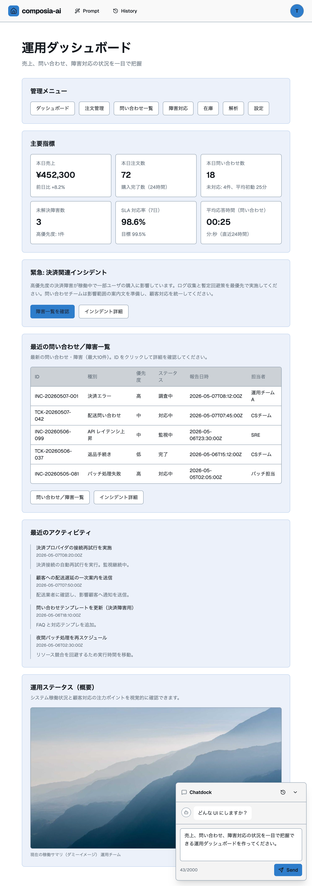

# composia-ai

composia-ai は、プロンプトから業務アプリの画面を生成し、保存済みの画面を履歴から再現し、画面内のアクションから次に必要な画面へ分岐できる AI UI 生成ランタイムです。

AI に任意の HTML / React / SQL を生成させるのではなく、アプリケーション側で許可した App UI Schema、json-render catalog、registry component の範囲だけで画面を構成します。生成結果は Zod と catalog validation を通過したものだけが保存・描画されます。



## 何ができるか

- **Prompt Workspace**: 自然言語のプロンプトから、業務ダッシュボード、一覧、フォーム、ワークフロー、チャット、エディタ、比較画面などの App UI Schema を生成します。
- **History Replay**: 生成された画面を PostgreSQL に保存し、`/history` と `/prompt/$screenId` から LLM を呼ばずに再描画できます。
- **Intent Navigation**: 生成画面内の action をクリックすると、親画面・クリック内容・source context を使って次画面の intent を推定し、child screen として保存します。
- **Controlled AI Output**: AI 出力は `shared/schemas` の Zod schema と component catalog の allowlist を通して検証されます。
- **Data Context**: RSS / API / Markdown / PostgreSQL 由来のデータを Normalized Entity として取り込み、AI layout planner の文脈に渡せます。
- **Full-stack Type Safety**: Hono RPC、Zod schema、TanStack Query により、backend/frontend の契約を共有します。

## 画面と主導線

ユーザー向けの主導線は、固定の管理画面ではなく「生成・履歴・再現・次画面生成」に寄せています。

| Route | 役割 |
| --- | --- |
| `/` | プロダクトの入口 |
| `/prompt` | プロンプトから画面を生成する workspace |
| `/prompt/$screenId` | 保存済み generated screen の再描画 |
| `/history` | 生成履歴の一覧、検索、削除、再現 |
| `/login` | local / OAuth login |
| `/oauth/callback` | OAuth callback 後の session 復元 |
| `/api/ui` | OpenAPI Swagger UI |
| `/api/doc` | OpenAPI JSON |

## アーキテクチャ

中核のデータフローは次の通りです。

```txt
Prompt / Action
  -> AI Layout Planner
  -> App UI Schema
  -> Zod validation
  -> Component catalog validation
  -> json-render Spec
  -> App-local React registry component
  -> Generated screen history
```

AI が扱える語彙は高水準の catalog component に限定しています。`Button`、`Card`、`Input` のような低レベル部品を AI に直接選ばせず、画面・セクション単位の component に閉じ込めています。

代表的な catalog component:

- `SidebarPage`
- `KpiSummarySection`
- `DataTableSection`
- `SplitHeroSection`
- `CarouselSection`
- `ProcessStepperSection`
- `CardGridSection`
- `FilterBarSection`
- `FormSection`
- `MasterDetailSection`
- `KanbanSection`
- `CalendarSection`
- `ChatPanelSection`
- `EditorPreviewSection`
- `ComparisonSection`
- `ActionFooterSection`
- `ImageSection`

## 技術スタック

### Backend

- Hono + Node.js adapter
- Hono RPC
- `@hono/zod-openapi`
- Drizzle ORM
- PostgreSQL / postgres.js
- JWT access / refresh token
- OAuth 2.0 Google / GitHub
- CORS、CSRF、secure headers、rate limiter、request logger

### Frontend

- React 19
- Vite
- TanStack Router
- TanStack Query
- TanStack Table
- Tailwind CSS v4
- shadcn/Radix primitives
- `@json-render/core`
- `@json-render/react`
- App-local registry components
- CSS variables based design tokens

### Quality

- TypeScript
- Vitest
- Playwright
- Biome
- MSW
- OpenAPI document generation

## クイックスタート

### 前提条件

- Node.js 20+
- pnpm
- Docker / Docker Compose

### セットアップ

1. 依存関係をインストールします。

   ```bash
   pnpm install
   ```

2. 環境変数を用意します。

   ```bash
   cp .env.example .env
   ```

3. PostgreSQL を起動します。

   ```bash
   docker-compose up -d
   ```

4. DB migration と seed を実行します。

   ```bash
   pnpm db:migrate
   pnpm db:seed
   ```

5. 開発サーバーを起動します。

   ```bash
   pnpm dev
   ```

アプリケーション、API、Swagger UI は `http://localhost:5173` から利用できます。

## 環境変数

`.env.example` をベースに設定します。

### 必須

| 変数 | 説明 |
| --- | --- |
| `DATABASE_URL` | PostgreSQL 接続文字列 |
| `JWT_SECRET` | 32文字以上の JWT secret |
| `APP_URL` | OAuth を使う場合に必須 |
| `CORS_ORIGIN` | 許可する frontend origin。`,` 区切りで複数指定可能 |

### 認証

| 変数 | 説明 |
| --- | --- |
| `AUTH_MODE` | `local`、`oauth`、`both` |
| `GOOGLE_CLIENT_ID` / `GOOGLE_CLIENT_SECRET` | Google OAuth |
| `GITHUB_CLIENT_ID` / `GITHUB_CLIENT_SECRET` | GitHub OAuth |
| `COOKIE_SAME_SITE` | `lax`、`strict`、`none` |
| `TRUST_PROXY` | reverse proxy 配下で `true` |

`COOKIE_SAME_SITE=none` を使う場合は、HTTPS の `APP_URL` または `NODE_ENV=production` による secure cookie が必要です。

### AI provider

| 変数 | 説明 |
| --- | --- |
| `OPENAI_API_KEY` | OpenAI Responses API を使う場合に設定 |
| `OPENAI_MODEL` | OpenAI model。未指定時は `.env.example` の値 |
| `AZURE_OPENAI_API_KEY` | Azure OpenAI を使う場合に設定 |
| `AZURE_OPENAI_ENDPOINT` | Azure OpenAI endpoint |
| `AZURE_OPENAI_DEPLOYMENT_NAME` | Azure OpenAI deployment name |
| `AZURE_OPENAI_API_VERSION` | Azure OpenAI API version |

Azure OpenAI は key、endpoint、deployment name をセットで設定します。OpenAI / Azure OpenAI のどちらも未設定の場合、AI layout generation endpoint は provider 未設定として失敗します。

## 主要コマンド

| コマンド | 説明 |
| --- | --- |
| `pnpm dev` | Vite + Hono dev server |
| `pnpm build` | frontend / backend の production build |
| `pnpm start` | `dist-api/index.js` を production mode で起動 |
| `pnpm typecheck` | TypeScript type check |
| `pnpm lint` | Biome check |
| `pnpm test` | Vitest |
| `pnpm test:coverage` | Vitest coverage |
| `pnpm test:e2e` | Playwright E2E |
| `pnpm test:e2e:smoke` | `@smoke` E2E |
| `pnpm test:e2e:regression` | `@regression` E2E |
| `pnpm verify` | `typecheck`、`lint`、`vitest run` |
| `pnpm db:generate` | Drizzle migration SQL 生成 |
| `pnpm db:migrate` | migration 適用 |
| `pnpm db:push` | 開発用途の schema push |
| `pnpm db:studio` | Drizzle Studio |
| `pnpm db:seed` | seed data 投入 |

## API domain

Backend は domain ごとの 3 層構成を基本にしています。

```txt
api/modules/<domain>/<domain>.routes.ts
  request validation / response

api/modules/<domain>/<domain>.service.ts
  use case / business rule

api/modules/<domain>/<domain>.repository.ts
  Drizzle query / persistence
```

主な domain:

- `ai`: layout / summarize / classify / navigation
- `screen-history`: generated screen 保存、履歴、再描画、action 分岐
- `sources`: RSS / API / Markdown / PostgreSQL source の登録と refresh
- `entities`: normalized entity の list / detail / metadata
- `cache`: AI layout decision などの key-value cache
- `ui-schema`: schema validation / preview
- `auth` / `oauth`: local login、refresh token、OAuth
- `health`: liveness / readiness

## Frontend domain

Frontend は route shell と domain 実装を分けています。

```txt
src/routes/*
  -> src/modules/<domain>/hooks
  -> src/modules/<domain>/repositories
  -> src/lib/api.ts
```

主な frontend module:

- `src/modules/screen-history`: Prompt workspace、履歴、generated screen hooks
- `src/modules/ui-schema`: App UI Schema から json-render spec への変換と renderer
- `src/modules/component-registry`: App-local catalog / registry component
- `src/modules/sources`: source UI と API client
- `src/modules/entities`: entity table / detail / form surface
- `src/modules/cache`: cache status UI

## AI安全境界

生成系の安全境界はコード上で明示されています。

- AI provider は App UI Schema JSON だけを返す前提です。
- 出力は `appUiSchemaSchema` で検証されます。
- component 名、source、props は `app-catalog.schema.ts` の catalog validation を通ります。
- link は app-relative path に制限されます。
- image URL は allowlisted HTTPS host のみに制限されます。
- 生成結果は schema validation と catalog validation を通った場合だけ cache / history に保存されます。
- frontend は OpenAI / Azure OpenAI を直接呼びません。

## Database

主な table:

- `users`
- `refresh_tokens`
- `user_external_accounts`
- `source_definitions`
- `normalized_entities`
- `cache_entries`
- `prompt_sessions`
- `generated_screens`

migration は `drizzle/migrations` に保存します。本番相当の運用では `pnpm db:push` ではなく、生成済み migration をレビューして `pnpm db:migrate` で適用してください。

## テスト

テストは次の観点で分かれています。

- schema validation
- service behavior
- route contract
- auth middleware / cookie flow
- AI provider output handling
- component registry validation
- ui-schema renderer
- Playwright による主要導線 smoke / regression

E2E のタグ運用:

- `@smoke`: 主要導線の高速確認
- `@regression`: 回帰確認用の広めの導線

## 現在のMVP範囲

実装済み:

- App UI Schema / component catalog / renderer
- Prompt から generated screen を保存
- History から保存済み schema を再描画
- action click から次画面を生成して child screen として保存
- Source -> Normalized Entity -> AI context の基礎導線
- OpenAI / Azure OpenAI provider
- AI layout cache
- local / OAuth auth
- OpenAPI document

未完・今後の拡張候補:

- 生成UIの screenshot regression / golden prompt 評価
- action `submit` の実データ mutation 連携
- source refresh の運用UIとスケジューリング
- bundle code splitting
- design token / theme authoring workflow
- production observability

## ドキュメント

- [Composia UI Project Plan](docs/project_plan.md)
- [Design System Sync Plan](docs/design-system-sync-plan.md)

## ライセンス

MIT
